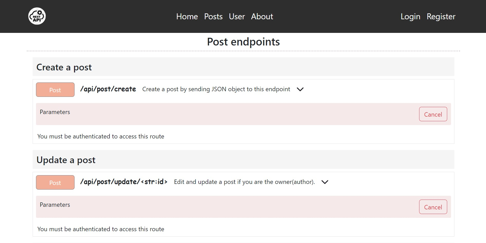
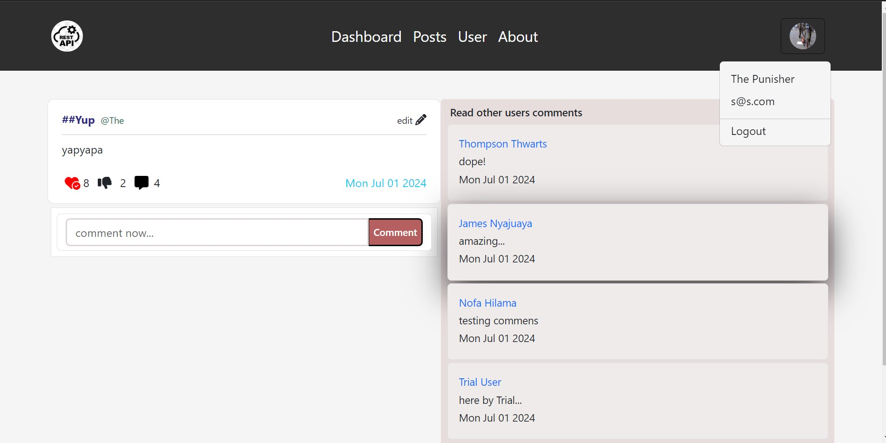
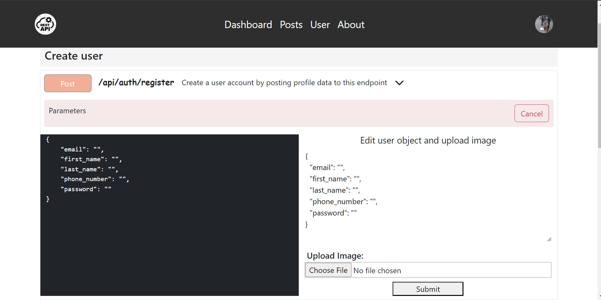

# A Complete Guide to Learning APIs Development

#### Backend Django url endpoint:
[https://apis-backend-3ba457041cc4.herokuapp.com/api](https://apis-backend-3ba457041cc4.herokuapp.com/api)

```
DISCLAIMER: I am using Cloudinary to store the images.
Files will be deleted after 24 hours.
```

### Created User Endpoints web page


### View Post Page with its Actions


## Technologies Used
```
Python Programming Language (Python version > py 3.4)
Django 
Django REST Framework 
PostgreSQL
Simple JWT Tokens
ReactJS
Bootstrap
Context Manager(AuthContext)
Axios
FontAwesome icons
```

## Backend Setup
#### Clone the Repository -- HTTPS
```bash
git clone https://github.com/Mount-Isaac/APIs_Development.git
```

#### Clone the Repository -- SSH
```bash
git clone git@github.com:Mount-Isaac/APIs_Development.git
```
#### Clone the repository -- GitHub CLI
```bash 
gh repo clone Mount-Isaac/APIs_Development
```
#### Install virtualenv library using pip
```bash
cd backend
pip install virtualenv
```


##### Create a Virtal Environment
```bash
virtualenv env
```

#### Windows OS activate virtual environment
```bash
env\Scripts\activate
```

#### UNIX OS activate virtual environment
```bash
source bin\activate
```


#### Install the requirements
```bash
pip install -r requirements.txt
```

<p>start a shell/command prompt/powershell/terminal instance in the root</p>

```bash
python manage.py runserver
```

## Frontend Setup
#### Install the requirements
Ensure Node manager is installed [https://nodejs.org/en](https://nodejs.org/en)

```bash
cd frontend
npm install
```

<p>Start a shell/terminal/command prompt instance in this folder and run:</p>

```bash
npm start
yarn start
```


#### Logged in user homepage


#### User endpoints web page


### Create user Endpoint API



<p>Happy Learning :) </p>